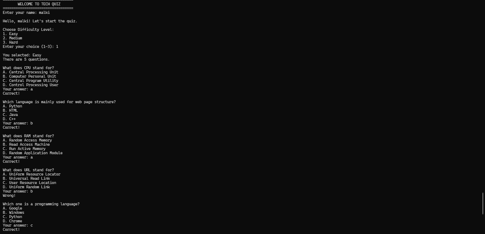
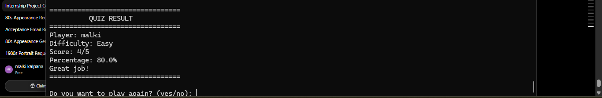

# Tech Quiz Game 🎯

A simple command-line Tech Quiz Game built with Python.

This project was created to practice Python programming concepts, problem-solving, functions, lists, dictionaries, input validation, randomization, and Git/GitHub workflow.

## ✨ Features

* 👤 Player name input
* 🎯 Three difficulty levels:

  * Easy
  * Medium
  * Hard
* 🎲 Random question order
* 📝 Multiple-choice questions
* ✅ Input validation
* 📊 Score calculation
* 📈 Percentage calculation
* 🏆 Performance feedback
* 🔄 Play again option
* 💻 Simple command-line interface

## 🛠️ Technologies Used

* Python
* Git
* GitHub
* Visual Studio Code

## 📂 Project Structure

```text
tech-quiz-game/
│
├── main.py
├── README.md
└── screenshots/
    ├── welcome.png
    ├── questions.png
    └── result.png
```

## ▶️ How to Run

### 1. Clone the repository

```bash
git clone https://github.com/Malki-19/tech-quiz-game.git
```

### 2. Open the project folder

```bash
cd tech-quiz-game
```

### 3. Run the game

```bash
python main.py
```

## 🎮 How to Play

1. Enter your name.
2. Select a difficulty level.
3. Answer each question using A, B, C, or D.
4. Complete all questions.
5. View your final score and percentage.
6. Choose whether to play again.

## 📊 Difficulty Levels

| Level  | Description                                         |
| ------ | --------------------------------------------------- |
| Easy   | Basic technology questions                          |
| Medium | Intermediate programming and IT questions           |
| Hard   | Advanced programming and computer science questions |

## 🏆 Score Feedback

The game provides feedback based on the final percentage:

* **100%** → Excellent! Perfect score!
* **75% or above** → Great job!
* **50% or above** → Good effort! Keep practicing!
* **Below 50%** → Keep practicing and try again!

## 📸 Screenshots

### Welcome Screen


### Quiz Questions



### Quiz Result



## 👩‍💻 Author

**Malki**

BSc (Hons) Software Engineering Student

GitHub: [Malki-19](https://github.com/Malki-19)
